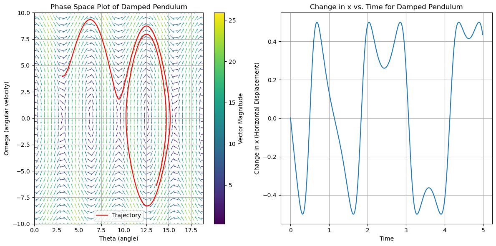

# Dynamical Systems with Forcing
Experimenting with different dynamical systems and simple control techniques.

## Setup
Install the packages using the `requirements.txt` file.

```bash
# using conda
conda create --name control --file requirements.txt
# Or pip
pip install requirements.txt
```

## Usage
The notebooks contain the implementations to: LQR and handpicking poles for the gain matrices to solve the pendulum and cartpole dynamical systems with linear control, Neural ordinary differential equations (ODEs), and sparse identification of nonlinear dynamical systems (SINDy).

## Linear Control
$$
\dot{x} = Ax + Bu \\
u = -Kx \\
x = (A-BK)x
$$

The equations to the linear control techniques finding an appropriate Gain matrix K by handpicking the poles or using LQR on the Pendulum and Cartpole dynamical systems.

An example of the Pendulum phase space and a specific trajectory:


## Neural ODEs

WIP

## SINDy

WIP

## References 
- Steven L. Brunton, Joshua L. Proctor, & J. Nathan Kutz (2016). Discovering governing equations from data by sparse identification of nonlinear dynamical systems. Proceedings of the National Academy of Sciences, 113(15), 3932–3937.
- Ricky T. Q. Chen, Yulia Rubanova, Jesse Bettencourt, & David Duvenaud. (2019). Neural Ordinary Differential Equations.

## Acknowledgements
Many thanks to the amazing [course](https://www.youtube.com/watch?v=9fQkLQZe3u8&list=PLMrJAkhIeNNTYaOnVI3QpH7jgULnAmvPA&ab_channel=SteveBrunton) on "Differential Equations & Dynamical Systems" by Steve Brunton, and author of this github repository for sharing his version of cartpole for simple experimentation, https://github.com/billtubbs/gym-CartPole-bt-v0/.